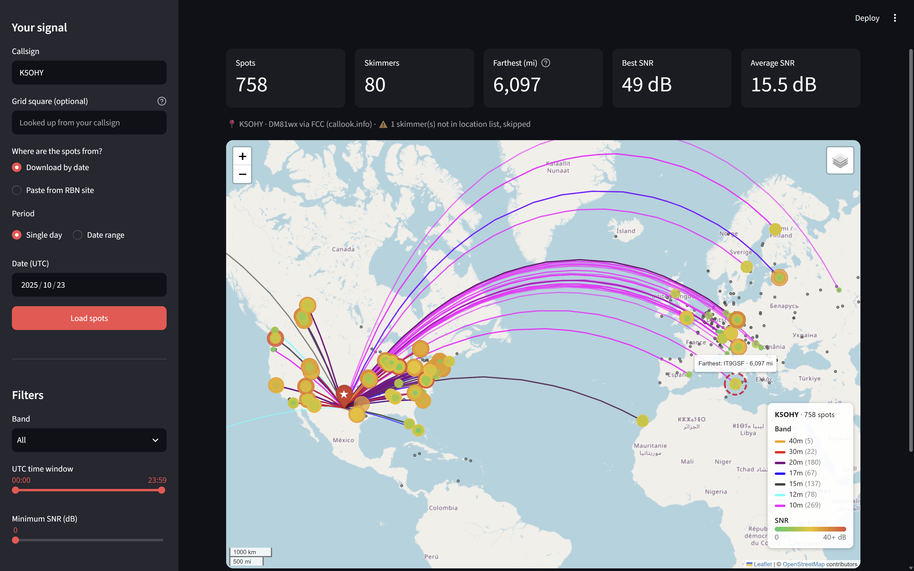

# RBN Signal Mapper

Map the [Reverse Beacon Network](https://www.reversebeacon.net/) stations that spotted your CQ, or the [WSPR](https://wsprnet.org/) stations that heard your beacon, and see how strong your signal was.

Enter a callsign and load your spots, and the app draws a path from your station to every station that heard you. Paths are coloured by band, and the dots are sized and coloured by SNR. Click a dot to see every spot from that station as a small chart. A **compare mode** sets two tests side by side (two antennas, two power levels, two frequencies) and tells you which one is getting out better, by how much, and in which directions.

**Try the beta online, nothing to install: [rbn-map-beta.streamlit.app](https://rbn-map-beta.streamlit.app/)** (the stable version is at [rbnmap.streamlit.app](https://rbnmap.streamlit.app/))



## Contents

- [Quick start](#quick-start)
- [Using the website](#using-the-website)
- [Getting your spots in](#getting-your-spots-in)
- [Features](#features)
- [Compare mode: which antenna is better?](#compare-mode-which-antenna-is-better)
- [Run it locally](#run-it-locally)
- [Troubleshooting](#troubleshooting)
- [Files](#files)
- [Data sources and thanks](#data-sources-and-thanks)

## Quick start

1. Open [rbn-map-beta.streamlit.app](https://rbn-map-beta.streamlit.app/) (or [run it locally](#run-it-locally)).
2. Type your **callsign** in the sidebar.
3. Choose where the spots come from: **Download by date** for a past day, or **Paste from RBN site** for spots from the last few minutes or hours.
4. Click **Load spots**.
5. Use the filters and map settings in the sidebar to explore, and download the map if you want to share it.

## Using the website

The hosted beta at [rbn-map-beta.streamlit.app](https://rbn-map-beta.streamlit.app/) is the same app you can run yourself. Everything is in the sidebar on the left, and the results appear on the right.

1. **Callsign.** Your callsign, for example `K5OHY`. The map is centred on your registered location.
2. **Grid square (optional).** Leave it blank to use your callsign's registered address. Enter a 4, 6 or 8 character grid (for example `EM10` or `EM10ci`) if you were portable, or if the lookup could not find you.
3. **Where are the spots from?** See [Getting your spots in](#getting-your-spots-in).
4. **Load spots.** Nothing is fetched until you click this. After that the filters below update the map instantly.
5. **Filters.** Band, UTC time window, and minimum SNR.
6. **Compare mode.** Off by default. See [Compare mode](#compare-mode-which-antenna-is-better).
7. **Map.** Choose a map style, show every skimmer on the map, and switch between miles and kilometres.

Notes for the website:

- Free Streamlit hosting can put an app to sleep when nobody has used it for a while. If you see a message saying so, click the button to wake it up. It can take a short while to start.
- The hosted app does **not** remember your settings between visits, because it is shared. Run it locally if you want your callsign and preferences saved.
- Downloading a whole day of RBN data can take a minute. The progress bar shows what it is doing.

## Getting your spots in

There are three ways to load spots.

### Download by date

Use this for anything up to yesterday (UTC).

- **Single day:** pick a date.
- **Date range:** pick a From and To date, up to 7 days. Each day is a separate download.

The app pulls RBN's daily history file, keeps only spots of your callsign, and throws the rest away. RBN publishes each day's file after the UTC day ends, so **today's spots are not available this way**. If you pick a date with no file yet, the app tells you to try an earlier date.

### Paste from RBN site

Use this for spots from right now, or for anything the daily files do not have yet. This is the way to go for quick antenna tests.

1. Go to [reversebeacon.net](https://www.reversebeacon.net/) and look up the spots for your callsign.
2. Select the spot rows in the table and copy them. It does not matter whether you include the header row.
3. Paste them into the **Paste spot rows here** box in the sidebar.
4. Click **Load spots**.

Each row looks like this once pasted:

```
K1RA-4    K5OHY    DM81wx    1443 mi    14073.0    CW    CQ    7 dB    25 wpm    1908z 26 Sep    94 seconds ago
```

The app reads the fields by what they look like, not by column position, so it also copes with tabs turned into spaces, thousands separators in the distance, and a missing "seen" column. If it cannot read any rows, it shows the first line it could not read.

### WSPR (wspr.live)

Use this to test with WSPR beacons instead of CQ calls. WSPR sends a short, automatic transmission every two minutes at a power you choose, and receivers around the world report it. That makes it a very repeatable signal for antenna testing: the power is fixed and every report includes it.

1. Choose **WSPR (wspr.live)** under *Where are the spots from?*
2. Pick the **Period** and **Date (UTC)**, exactly as for RBN (WSPR can also load today), and click **Load spots**. The app looks for WSPR spots from the callsign you entered at the top, so use the callsign your WSPR transmitter sends.
3. Use the **UTC time window** slider under Filters to narrow things to your test. After loading, the slider covers just the span of the spots you loaded and opens on the latest 30 minutes, with one-minute steps.

Spots come from the public [wspr.live](https://wspr.live/) database, which mirrors wsprnet.org. **Reports take about 5 minutes to arrive in full** after a transmission starts (about 3 after it ends): one that is only a minute or two old may show just a handful of receivers. The app still uses them, marks them *may be incomplete*, and tells you when to click **Load spots** again to refresh the result. Because each WSPR spot carries the receiver's own location and the transmit power, no skimmer list is needed, and the app can correct for a power difference between two tests.

Things that differ from RBN:

- WSPR SNR is measured against a much lower noise reference, so values are mostly negative (about -30 to +5 dB). The map colours use their own scale for WSPR.
- Stations that heard you are called **receivers**, not skimmers.
- **Show all skimmers** is not available, since there is no list of every WSPR receiver.
- Comparing two antennas is switched on by default, since that is what a WSPR test is for. Untick it in the sidebar to see just the map.

## Features

### Map

- **Paths from you to every skimmer** that heard you, drawn as great circles (the real shortest route over the globe), so they curve the way radio paths do and do not jump across the edge of the map.
- **Colour by band.** Paths use the same band colours as the RBN website.
- **Dots by SNR.** Each skimmer's dot is sized and coloured by signal strength: small green for weak (about 5 dB), yellow for medium, large dark red for strong (35 dB and above). A legend in the corner shows the scale and how many spots there are per band.
- **Click a dot** to see the skimmer, band, frequency, SNR, time (UTC) and distance.
- **Farthest skimmer** is circled on the map and labelled with its distance.
- **Layers.** The layer button (top right of the map) turns the paths, the spots, and the optional "all skimmers" layer on and off.
- **Show all skimmers** (sidebar) adds a small grey dot for every RBN skimmer, including the ones that did not hear you. Useful for seeing where you were *not* heard.
- **Map style.** Light, dark, satellite or street. No API keys are needed.
- **Distance units.** Miles or kilometres, used everywhere in the app.
- **Download map.** Saves the map as a standalone HTML file that works offline in any browser. Good for sharing.

### Your location

The map pin is placed using the first of these that works:

1. The grid square you typed in the sidebar.
2. The RBN skimmer list, if your callsign is also a skimmer.
3. The FCC database via [callook.info](https://callook.info) (US callsigns).
4. [HamDB](https://hamdb.org) (many other countries).
5. The centre of your callsign's country, as an approximate fallback. The app warns you when it does this, so you can enter a grid for an accurate map.

The pin's popup tells you which source was used.

### Filters

All three update the map instantly, without reloading anything.

- **Band.** All, or one band from 160m to 6m.
- **UTC time window.** Only show spots between two times of day, in one-minute steps. For WSPR it follows the spots you loaded, so you can drag it onto just your test.
- **Minimum SNR.** Hide weak reports.

### Stats

Above the map you get: total spots, number of skimmers, farthest skimmer (with distance), best SNR, and average SNR. If some skimmers are not in the RBN node list, the app lists them and says they cannot be shown on the map.

### Direction of your spots

Below the map, a compass chart splits your spots into 16 directions. Bar length is the number of spots in that direction, and the colour is the average SNR (same colour scale as the map). A summary tells you where you got the most spots and where you were strongest on average. This is handy for seeing what a beam or a vertical really does.

### Spot table

Expand **Spot table** at the bottom to see every spot as a sortable table.

### Always-current skimmer list

Skimmer locations come straight from reversebeacon.net and are refreshed automatically once every 24 hours. Skimmers that later drop off RBN's list are kept, so old history files still plot correctly.

### Remembers your settings (locally)

When you run it on your own computer, the app saves your callsign, grid, band, map style and other choices in `settings.json` and restores them next time. This is switched off on the shared website.

## Compare mode: which antenna is better?

Compare mode is for A/B tests: anything where you want to know which of two setups gets out better. Two antennas, two power levels, two feedlines. It works with RBN spots and with WSPR.

Tick **Compare two antennas or tests** in the sidebar, then choose how the app should tell A and B apart.

### Ways to tell A from B

**WSPR: the antenna log.** After you load your spots, the app lists every transmission it found (the UTC time, how many receivers heard it) with an **Antenna** dropdown beside each, like the time-slot sheet N4REE keeps for his tests. It fills the antenna in for you, alternating down the list; use the **Order** choice for *A, B, A, B*, *B, A, B, A* or *A, B, B, A* (which balances which antenna goes first in each pair). Change any row to match your notes, or clear a row to leave it out, for example a transmission from before the test began. That is all there is to it, and it works for a test of a single A/B pair as well as a long one.

**RBN** (choose one in the sidebar):

- **Two frequencies.** You sent on two different frequencies, for example the dipole on 14069.5 kHz and the loop on 14070.5. Spots are split into groups of nearby frequencies; the two biggest are chosen as A and B (change them with the dropdowns). Skimmers report slightly different frequencies for the same signal, so spots closer than the **Frequency gap** (default 0.5 kHz) count as one frequency. Lower it if two tests were merged, raise it if one was split.
- **One after the other.** One antenna for a while, then the other. Drag the handles to say when each was connected. The defaults split at the longest quiet gap, or down the middle if there isn't one. This is the weakest test, since the time of day changes between the two (see below).
- **Swap every few minutes.** You change antenna on a timer, for example every 10 minutes. Tell the app when the first block started and how long each lasted. *Ignore after change* drops the first minutes of each block in case the change was still happening.

You can give each side a name ("Dipole", "40m loop") under *Name your antennas* and it is used throughout the results.

### How to run a test

**With WSPR** (best for antennas), following [N4REE's method](https://www.bob-easton.com/n4ree/). Each transmission lasts about 111 seconds in a 120-second slot, so you have a few seconds between transmissions to flip a coax switch:

1. Connect the transmitter to an A/B coax switch with one antenna on each output, both matched on the test band. Test one band at a time, with the same power, callsign and location throughout.
2. Let the transmitter send in every slot. On a ZachTek Desktop, turn off the pause between band cycles, and leave *High precision 6 char locator* off, because that option sends the information in two separate packets, which makes it hard to say which antenna sent which.
3. Switch after the RF stops (the transmit light goes off) and before the next transmission starts: A, B, and perhaps another round of A, B, then stop. Only the cycles of your test matter; the app doesn't assume the switching goes on all day. Write down the time and which antenna was on for the first transmission. **A whole test can be under 10 minutes**, even one 2-minute transmission on each antenna, but a quick test can be swung by fading; 6 to 8 cycles per antenna (about 20 minutes) gives a result you can rely on, and repeating it on another day is better still.
4. **Wait about 5 minutes** after your last cycle starts for the reports to arrive, choose **WSPR (wspr.live)**, pick the date, and click **Load spots**.
5. Pick the band, then drag the **UTC time window** so it covers just your first cycle to your last. The antenna list shows only those cycles.
6. Check the **Order** choice matches what you did, fix any row that doesn't (or clear a row to leave it out), and read the result.

**With RBN:**

1. Call CQ on frequency **A** for a few minutes, then on frequency **B** with the other antenna.
2. Copy the spot rows from the RBN website and paste them in (see [Paste from RBN site](#paste-from-rbn-site)), or download the day's file afterwards.
3. Tick **Compare two antennas or tests**, choose **Two frequencies**, and click **Load spots**.

Tips for a fair test:

- Keep the two tests close together in time. Which stations can hear you changes through the day, so antennas tested hours apart are partly being compared against the clock. Changing antenna every transmission, or every few minutes, avoids this.
- Give each side enough time that plenty of stations hear it.
- Use the same power and the same speed. If you can't, enter the power under **Power** (RBN) or leave the correction on (WSPR, where the power is in the spots).

### Reading the results

The results are in four tabs:

- **Result.** The verdict first: a plain-English answer saying which is getting out better, whether they are equal, or whether it is too close to call, with the evidence under it (reach, strength, farthest and typical distance, direction, and for a longer test how consistent it was from pair to pair) and any caveats. Under it, a scoreboard with A and B side by side, a bar showing who heard you (*only A*, *both*, *only B*), and for longer tests a timeline of every spot.
- **Direction & distance.** A compass chart of average SNR toward each direction, and a table of which side is better toward each of the eight directions; then the same by distance range. Longer paths usually mean a lower take-off angle, so an antenna that wins close in while the other wins far out is showing high-angle versus low-angle behaviour.
- **Receiver by receiver.** A scatter plot and table of every station that heard both sides. Dots above the dashed line are where B was stronger.
- **Maps.** The map for A next to the map for B, with the same view, SNR colours and dot sizes. Each map has its own download button.

### How the verdict is decided

- **Reach** counts the different stations that heard each side. For RBN, only the stations that heard just one side decide it, and an exact sign test says whether the imbalance is more than chance. For WSPR tests it is judged one pair of transmissions at a time (did A or B reach more receivers in each pair?), because fading on your own end raises or lowers the chance of every receiver at once, and counting receivers as if they were independent would flag differences that are only fading. Fewer than 6 decisive pairs can't be called.
- **Strength** compares only the stations that heard **both** sides, so each station is its own control. When the antennas alternate it compares the same station in neighbouring transmissions, takes the median of those differences for each station, and averages them, which cancels most of the drift in conditions. Averaging every report would mislead, since an antenna that reaches extra weak, distant stations would look worse for it. The average difference comes with a 95% range, which for WSPR tests also allows for that shared fading: measured round to round when there are 4 or more pairs, and with a typical measured allowance (about 0.85 dB per pair) when there are fewer. So a single pair can only pick out a difference of roughly 2 dB or more, and says "too close to call" otherwise. A side wins if that whole range is on its side and the gap is at least 1 dB; a smaller gap is reported as *equal*, because 1 dB is below what you would notice on the air.
- **Direction and distance** are only called "stronger" when at least 4 stations heard both sides there, the gap is at least 2 dB, and a stricter 99% range agrees. About fourteen ranges are checked at once, so this keeps chance from producing a "winner". A range can also be called for one side when it reached clearly more stations there.
- **Equal time on the air.** When A and B are separated in time, more time means more chances for a station to hear you. If one side was on the air more than 15% longer (for WSPR, counted in transmissions that actually happened), the app randomly trims it to match before comparing, and says so.
- **Who was listening** (WSPR). Many WSPR receivers hop between bands and listen to yours only in some time slots. If one antenna's transmissions happen to land on those slots, a receiver "only hears A" because of its own schedule, not the antenna. So the app asks wspr.live which receivers were decoding anything in each slot, and only counts a receiver if it was listening during both sides' transmissions. The verdict tells you how many were kept.
- **Power.** If the two sides used different power, B's SNR is shifted to A's power first. With a gap of 3 dB or more the correction is approximate, and the verdict says so.
- **One after the other.** When A and B ran in sequence, even a clear difference could come from the time of day, and the verdict says so instead of declaring the antenna the winner. Changing antenna after every transmission, or every few minutes, removes that doubt.

The sidebar filters (band, time window, minimum SNR) apply before the spots are split into A and B.

## Run it locally

You need [Python 3.9+](https://www.python.org/downloads/) and about a minute.

### Windows (PowerShell or Windows Terminal)

Set it up once:

```bash
git clone https://github.com/K5OHY/RBN_Map.git
cd RBN_Map
python -m venv .venv
.venv\Scripts\python -m pip install -r requirements.txt
```

Then start the app, from the project folder:

```bash
.venv\Scripts\streamlit run web.py
```

Use exactly that command. Typing plain `streamlit run web.py` fails with "streamlit is not recognized", because the packages are installed inside `.venv` and Windows does not know where to find them unless the environment is activated. Calling `.venv\Scripts\streamlit` directly means you never have to activate anything.

If `python` is not found, try `py -m venv .venv` instead.

### macOS / Linux

```bash
git clone https://github.com/K5OHY/RBN_Map.git
cd RBN_Map
python3 -m venv .venv
.venv/bin/python -m pip install -r requirements.txt
.venv/bin/streamlit run web.py
```

### Every time after that

Open a terminal in the project folder and run the last command again (`.venv\Scripts\streamlit run web.py` on Windows, `.venv/bin/streamlit run web.py` on macOS/Linux).

Streamlit prints a local address and usually opens your browser. If it does not, open http://localhost:8501. Stop the app with Ctrl+C in the terminal.

### Updating the skimmer list by hand

The app refreshes the skimmer list on its own every 24 hours. To force it right now:

```bash
.venv\Scripts\python rbn_to_csv.py
```

(On macOS/Linux: `.venv/bin/python rbn_to_csv.py`.)

## Troubleshooting

| What you see | What it means and what to do |
| --- | --- |
| "RBN has no data file for ... yet" | RBN publishes a day's file after the UTC day ends. Pick an earlier date, or use **Paste from RBN site** for today's spots. |
| "RBN has no spots of ... for that date" | Check the callsign, or try another day. If you pasted rows, make sure they are spots of your callsign. |
| "Couldn't read any spot rows from the pasted text" | The pasted text is not in the RBN spot table format. The message quotes the first line it could not read. Copy the rows straight from the RBN spot table. |
| "Couldn't find a location for ..." | Enter your grid square in the sidebar. |
| A warning that the pin is at the centre of a country | The lookups found nothing more precise. Enter your grid square for an accurate map. |
| "No location for ..." under the stats | Those skimmers are not in the RBN node list, so they are counted but not drawn on the map. |
| Compare mode says it found only one frequency group | Your spots are on one frequency, or the **Frequency gap** is too wide and merged your tests. Lower the gap in the sidebar. |
| Compare mode says no skimmer heard both frequencies | There is nothing to compare like for like. Compare the skimmer counts and directions instead, or try again with longer tests. |
| Downloading is slow | A day of RBN data is a large file, and each day in a range is a separate download. Results are cached for an hour. |

## Files

| File | Purpose |
| --- | --- |
| `web.py` | The Streamlit app: interface, maps, charts, compare mode |
| `compare_stats.py` | The A/B comparison maths and the plain-English verdict, shared by RBN and WSPR |
| `rbn_data.py` | Skimmer list refresh, callsign location lookup, grid-square conversion |
| `wspr_data.py` | Fetches and tidies WSPR spots from wspr.live |
| `spotter_coords.csv` | Cached skimmer locations (updated automatically) |
| `cty.dat` | Country prefix file from [country-files.com](https://www.country-files.com), used for the approximate-location fallback (updated monthly) |
| `rbn_to_csv.py` | Command-line shortcut to refresh the skimmer list now |
| `Update_spotters.py` | Older helper: converts an RBN node table you paste into the script into `updated_spotter_coords.csv`. Not needed for normal use. |
| `requirements.txt` | Python packages to install |
| `settings.json` | Your saved settings (created locally, never committed) |
| `images/` | Screenshot used by this README |

## Data sources and thanks

- [Reverse Beacon Network](https://www.reversebeacon.net/): spots and skimmer locations
- [wspr.live](https://wspr.live/) and [WSPRnet](https://wsprnet.org/): WSPR spots
- [callook.info](https://callook.info) and [HamDB](https://hamdb.org): callsign locations
- [country-files.com](https://www.country-files.com): country prefixes
- Map tiles: Esri, OpenStreetMap contributors
- Built with [Streamlit](https://streamlit.io/), [Folium](https://python-visualization.github.io/folium/), [pandas](https://pandas.pydata.org/), [Matplotlib](https://matplotlib.org/) and [GeographicLib](https://geographiclib.sourceforge.io/)

## License

MIT License.
